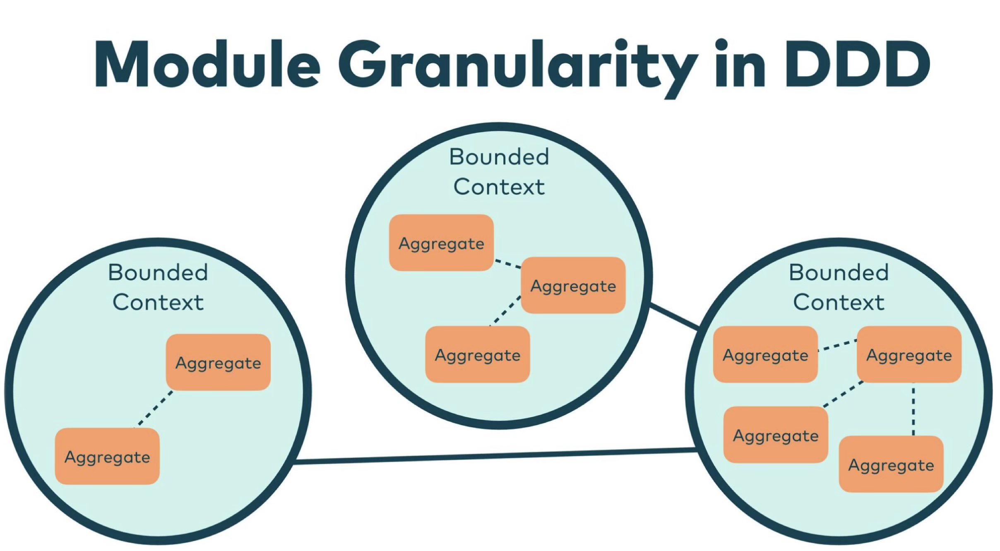

---
src: ./pages/2_plan.md
---

---
src: ./pages/3_before_start.md
---

---
src: ./pages/history_1.md
---

---
src: ./pages/waterfall_and_agile.md
---

---
layout: image-right
image: ./images/ddd_book_evans.png
backgroundSize: 60%
src: ./pages/history_2.md
---

---
layout: image-right
image: ./images/ddd_book_evans.png
backgroundSize: 60%
src: ./pages/history_3.md
---

---
src: ./pages/history_4.md
---

---
src: ./pages/4_intro.md
---

---

# Введение: ограниченный контекст

 

<!-- https://sli.dev/guide/faq#grids-and-flexboxes -->

  

    
    
 Источник: Getting modules right with Domain-driven Design (9) 

  

<SlideCurrentNo class="absolute bottom-[5px] left-1/2 transform -translate-x-1/2 items-center" />

---
layout: image-right
image: ./images/bbox_lang_problem.png
backgroundSize: 90%
---

# Введение: пример отсутствия единого языка

 

Как разные участники команды называют **_bounding box_**:
* box;
* face;
* facing;
* detection.

**Минусы**:
* больше лишней информации в голове;
* увеличение порога вхождения для новых участников команды;
* нет единых правил нейминга в коде.
<SlideCurrentNo class="absolute bottom-[5px] left-1/2 transform -translate-x-1/2 items-center" />

---

# Тактические паттерны DDD

 

<!-- https://sli.dev/guide/faq#grids-and-flexboxes -->

  

    
    
 Источник: «Агрегаты, мои агрегаты, как приятно о вас думать» (5) 

  

<SlideCurrentNo class="absolute bottom-[5px] left-1/2 transform -translate-x-1/2 items-center" />

---

# Тактические паттерны DDD: объект-значение

**Объект-значение** (_англ. **Value Object/VO**_) - объект предметной области, наделенный поведением, и являющийся частью связанной с ним сущности.

 

**Инвариант** - бизнес-правило, соблюдаемое _VO_, сущностью или агрегатом.

 

**Свойства объекта-значения**:
* **не имеет идентификатора**, т.к. является частью сущности;
* **моделирует** некий концептуально целостный **объект предметной области**;
* должен обладать **поведением** и **защищать** свойственные ему **инварианты**;
* **неизменяемый** (предпочтительно создавать новый объект вместо его мутирования).

<SlideCurrentNo class="absolute bottom-[5px] left-1/2 transform -translate-x-1/2 items-center" />

---
src: ./pages/tactical_patterns/vo_1.md
---

---
src: ./pages/tactical_patterns/vo_2_primitive_obsession.md
---

---
src: ./pages/tactical_patterns/aggregate_desc.md
---

---
layout: image
image: ./images/class_aggregate.png
backgroundSize: 63%
---
# Тактические паттерны DDD: агрегат
<SlideCurrentNo class="absolute bottom-[5px] left-1/2 transform -translate-x-1/2 items-center" />
---
src: ./pages/problem_example/problem.md
---

---
src: ./pages/problem_example/transaction_script.md
---

---
src: ./pages/problem_example/active_record.md
---

---
src: ./pages/problem_example/ddd.md
---

---
src: ./pages/problem_example/comparison_table.md
---

---
src: ./pages/architecture/unit_of_work.md
---

---
src: ./pages/architecture/domain_events.md
---

---
src: ./pages/sources.md
---

---
# https://sli.dev/builtin/layouts
layout: end
---
# Спасибо за внимание!
---